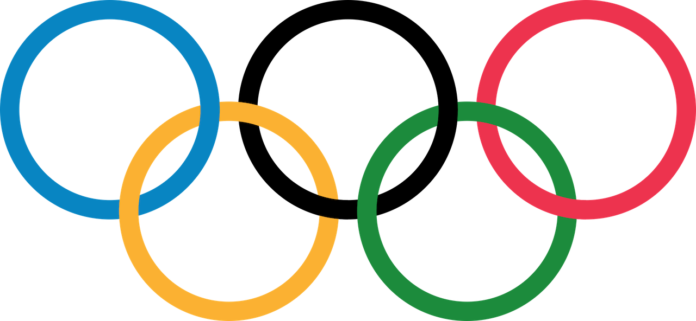

<h1>1995 Olympics Site Remake </h1>

A recreation of the 1995 Olympics site for a class assignment. The idea was to create 'a webpage that looks like a 1995 webpage'. I've included a [link](https://web.archive.org/web/19961223053702/http://www.olympic.org/) to the original Olympics website from 1995 for a comparison of what I was up against. 

&ast;I've used only HTML elements on all my pages, although I might've cheated in small parts by adding in-line styles. The only unrealistic aspect of the site for would be the images I've used, especially the banners on each page going to other ones. They are over 1MB which by 1995 standards would be overkill for bandwidth xD

